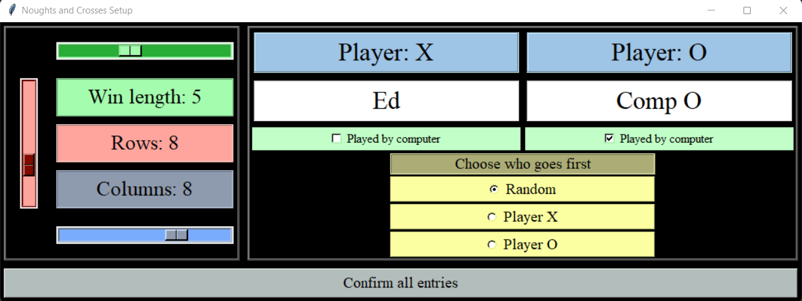
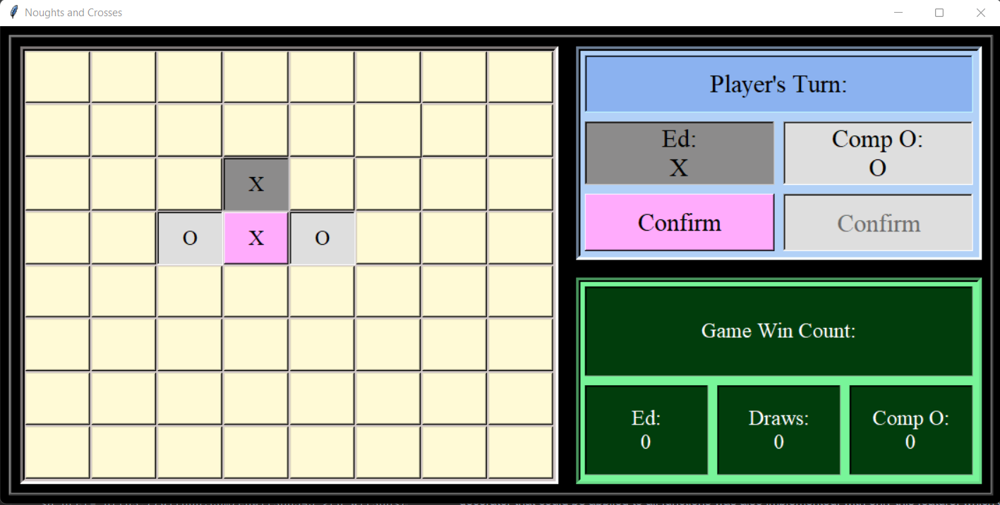
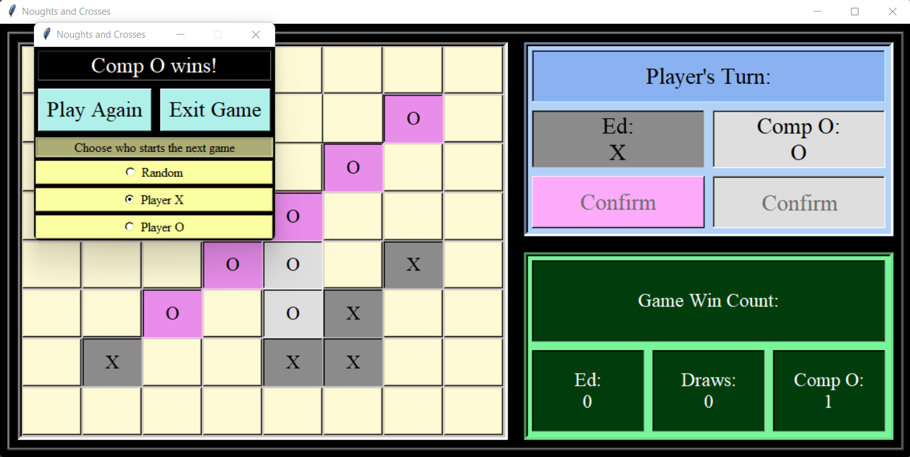

<h1> 'Noughts and Crosses' Project</h1>

<h4>
This repository is an m, n, k noughts and crosses (aka tic-tac-toe) application.
The game includes a tkinter GUI allowing users to play each other, as well as automatic play implemented using the
minimax algorithm.
</h4>

<h3>Authors and acknowledgement:</h3>

    <b>
        <a href="https://github.com/edwilson543">Ed Wilson</a>
    </b>
 
    <b>
        <a href="https://github.com/szepfalvibalint">Balint Szepfalvi</a>
    </b> 

<h3>Setup and gameplay:</h3>

    <b>1)</b> Clone the repository 
    <b>2)</b> Create a virtual environment 
    <b>3)</b> Install the application dependencies from the requirements.txt file 
    <b>4)</b> Run the play.py module in the root directory

<h3>GUI screenshots</h3>

<b>The game setup window:</b>

Players can choose to play a (3,3,3) to (10,10,10) game. They can then enter their name(s), choosing to either play
multi-player, single-player, or just watch the minimax player play against itself. Either player can go first, or this 
can be set to random (the default).
 
When a user clicks confirm, this tells the controller of the application to extract the data from the setup window, and 
launch a playing window of the defined format.

 

<b>The main game window (gameplay):</b>

The main board is a set of widgets using the tkinter grid layout manager. Occupied cells are labels, while available 
cells are buttons. Additionally, there is an 'active unconfirmed cell' button - the pink X in the image above. To make
their selection, the user clicks an empty (white) cell, it then turns pink, and then they click the 'Confirm' button beneath
their name in the top right-hand side. The widgets for each playing window are managed by a 'widget manager' dataclass.
The active unconfirmed cell can be cleared by clicking it again, or by clicking a different cell. Note that there is no
opportunity to play out of turn, because the marking (X/O) following a player's selection is derived directly from the
status of the game board (by summing it and taking the real part, see below).
 
The 'confirm' buttons are what moves the game forward - when these are clicked, either the game is over or it becomes the
turn of the next player. The highlighted and active confirmation button changes, and if it is a minimax player's turn, 
all buttons will be disabled until their move has been made.

 

<b>The main game window (game over pop-up):</b>

Wins/draws are automatically checked for after each move by the backend code. If a win is found, the streak will flash to
highlight where it is. Note that finding the location of a win requires some extra processing versus just checking for 
a win, and therefore the win checker effectively has 2 modes - check for win, or check for win then find the location.
 
The bottom-right frame in the main playing window records how many wins/draws have been achieved in the active session.
Following a win/draw a pop-up is then launched as shown in the image (this is a tkinter TopLevel). This allows looping 
of the game where users can keep playing, with either playing starting and the default being the loser of the previous 
game.

<h3>Notable or potentially interesting features of the application (backend only - GUI covered above):</h3>

<h5> Processing for the core game flow: </h5>

<b>Board representation:</b> The board has been represented by a numpy array where X/Os are represented by 1/-1s and 
empty cells by the imaginary number i (or in python 1j). This allows for rapid, vectorised extraction of data from the 
board (and copies of the board).
 

<b>Win checking:</b> The core idea used for searching for wins was to convolute the arrays intersecting the previous
move, clipped by the winning length, with an array of ones of the winning length. For example, a row containing an X-win
in a 3,3,3 game will produce (1, 1, 1) . (1, 1, 1) = 3, telling us there is a win since 3 is the required winning length.
In this example '.' is the 'dot product' but in the code is implemented as a discrete linear convolution.
 

<b>Caching searched boards:</b> A custom least recently used (LRU) cache was defined for the win search method, to avoid
repeatedly searching the same board for a win (largely relevant for minimax algorithm). This was implemented as a 
decorator class caching function returns in an ordered dict, and is applied to the win check function. The main
motivations for defining this cache decorator rather than just using the functools.lru_cache were: 
1) The custom decorator allowed caching based only on a subset of the win checking function's arguments, and only this
subset affects the return value, minimising the number of primary calls to the function.
2) The custom cache allows the symmetry of the board to be leveraged - i.e. when the win checker is called on a given
board, we can also create the symmetric equivalence class for the active board and cache all these boards against the
same return value. This is only relevant for the minimax player - note also that extensive profiling of this feature 
using cProfile (see game_profiling.py) showed that it does save time in smaller games (<=5x5), but for bigger games 
where there is quickly less symmetry, just slowed it down, so by default a use_symmetry argument of the decorator is 
set to False.
3) Some arguments of the win check are not hashable (numpy arrays), so are converted to tuples for creating the hash
keys. A separate decorator that could be applied to all functions was also implemented, with only this feature, 
which did leverage the existing functools.lru_cache. Note for the reasons above that the functools.lru_cache can never
be applied out of the box for functions taking numpy arrays as arguments.

<h5> Backend (minimax player): </h5>

<b>Minimax implementation (general):</b> The methodology used to get automated moves is an implementation of the minimax
algorithm, an established artificial intelligence algorithm. Minimax is used in this context to decide which move to
make on the current board by searching ahead in the game for favourable board configurations (and ultimately wins, 
losses and draws), assuming that the opposition also plays optimally.
 

<b>Minimax implementation (alpha-beta pruning):</b> Alpha-beta pruning was implemented, which significantly reduces the
number of nodes (future board configurations) which the algorithm has to search, by keeping track of the maximising and 
minimising player's respective best moves at each search depth, and never pursuing branches which are guaranteed to have
a less favourable end-state.
 

<b>Minimax implementation (iterative deepening):</b> 'Iterative deepening' here refers to iterating the minimax algorithm
at increasing maximum search depths until a fixed amount of time has run-out. The best move at each search depth is 
maintained, and replaced if a better one is found. This also includes a minimum search depth, and overall ensures that 
the algorithm spends a consistent amount of time searching, and quickly finds a move which can subsequently be
improved on.
 

<b>Minimax implementation (non-terminal board evaluation):</b>
A considered set of functions has been implemented for scoring non-terminal boards.
Note that by default the minimax algorithm as implemented is looking for terminal boards - wins, losses and draws.
A key idea here was the use of the imaginary i (or 1j in python) to represent empty cells - convolving with an array of
ones of the winning length then tells us immediately whether a given streak can be completed. For example in a 3x3 game, 
if we have a row (X, O, EMPTY), trying: 
(1, -1, 0) . (1, 1, 1) = 1, is not very helpful, whereas: 
(1, -1, i) . (1, 1, 1) = i, telling us that: abs(Real(0)) + abs(Imag(i)) = 1 < 3, therefore there cannot be a
winning streak within this row, and thus a score of 0 is awarded - which is more helpful. 
In general the score awarded to and individual streak depends on the scenario a given board configuration. 6
main scenarios are considered, defined according to whether the maximiser has the next turn (2 scenarios), and which 
player has the longest streak or if their longest streaks are equal in length (3 scenarios), noting that 2x3=6.
 

<b>Multiprocessing of the search space (Discarded)</b> 
The search space of the minimax algorithm can be very large for bigger boards: simulating a 10,10,5 game of minimax vs 
minimax that resulted in a draw, as one might hope, led to 145,407 calls to the 'get_minimax_move_at_max_search_depth' 
method, 277 primary calls, (and 100 calls of the method that controls the iterative deepening, noting 10x10=100).
This is hence a CPU-Bound program. Therefore, multiprocessing of the search space was trialled, using the built-in
multiprocessing package.
The nodes at search depth 0 were pooled, and concurrently the best move within each cpu process was found.
This worked, although profiling found that it actually added time. 
I expect because it was reducing the effectiveness of the alpha-beta pruning 
(due to each process having its own memory space, and thus their own alpha and beta values), and also the overheads 
introduced with repeatedly having to re-pool the processes at each max search depth.
Before finding an optimisation for this, it was found that despite being able to run simulations and profile the backend
code, the GUI structure would not allow multiprocessing. This is because tkinter apps are not picklable, and thus cannot
be split out and re-joined for multiprocessing.
 

<h3>Ideas for future extension:</h3>

<h5> Backend application:</h5>

<b> - Make fully n-dimensional.</b> Several methods have already been implemented as n-dimensional methods for generality, 
(most notably the win_check_and_location_search method, and most minimax methods), however not all have been.
 

<b> - Make the minimax player available at variable difficulties.</b> The current minimax player is intended to be as
difficult to play against as possible, subject to processing constraints. A difficulty level could be introduced most
simply by adding a random integer drawn from an interval [-a, a] to the board scoring system that informs the algorithm, 
where a is increased to make the game easier.
 

<b> - Leverage a transposition table/database.</b> This would be used to look up the outcome of different move in historic
games, to evaluate their effectiveness in an active game. Creating such a database could build on the GameSimulator in
game_simulation_base_class.py, and get_symmetry_set_of_tuples_from_array in utils.py to run simulations of games and
then store that simulation and it's entire equivalence class in the transposition database

<h5> Frontend application</h5>

<b> - Also expand the dimensionality of the game (probably just to 3 dimensions).</b> This could be achieved using 3D 
visualisation, or even more simply by displaying multiple two-dimensional playing grids.
 

<b> - Allowing players to create an account and save the outcome of previous games against different opposition.</b>
Fairly endless possibilities about what could be done with this and how it could be implemented, a leaderboard and or
player scores using the Glicko rating system (the system used by chess.com) could be fun.
 
<b> - General extensions to GUI.</b> Including allowing players to change the game parameters between games, adding 
different themes to the display (e.g. light/dark), and adding other features of popular games.

